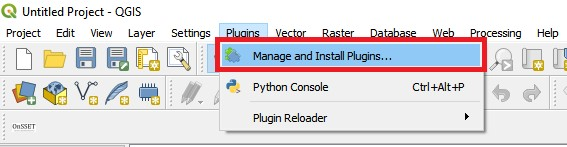
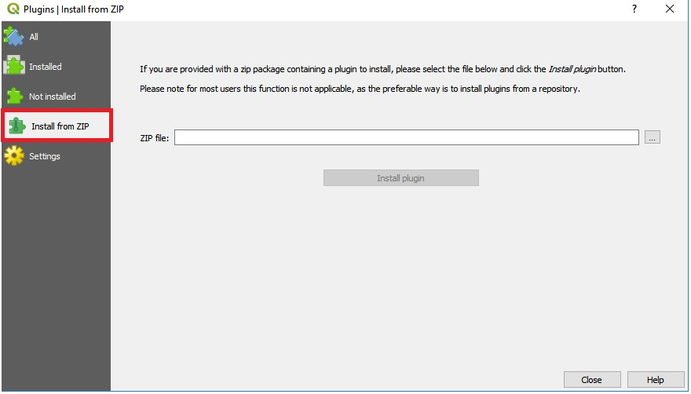
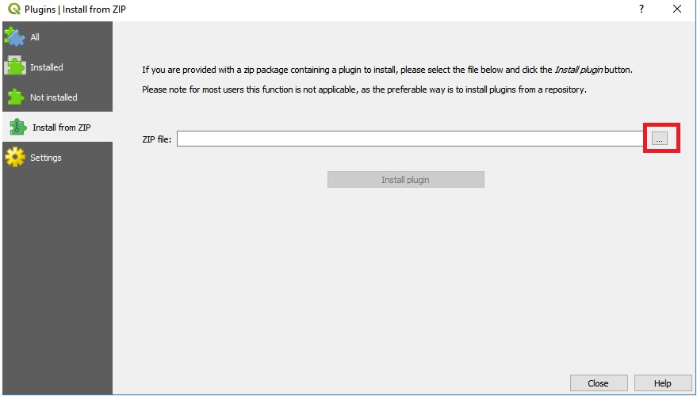
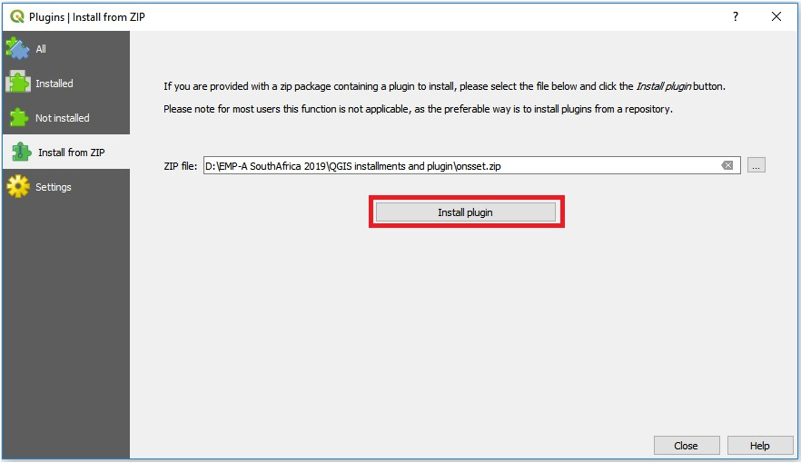
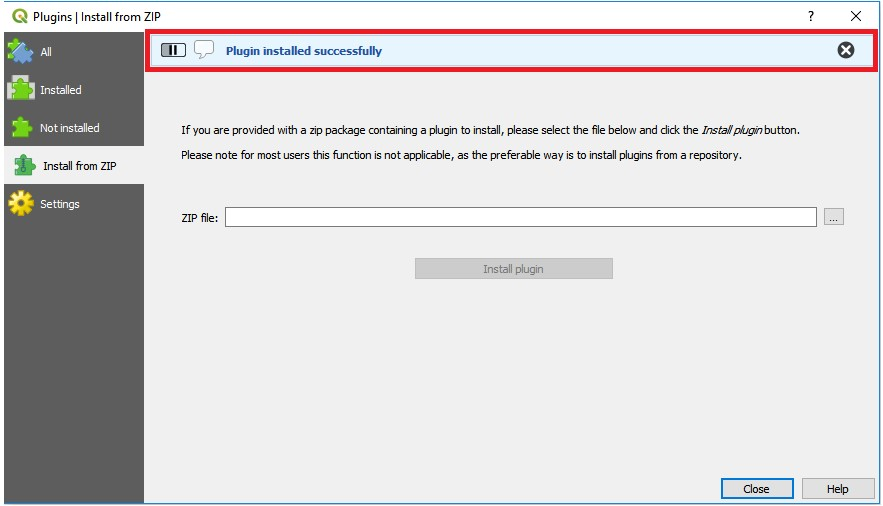
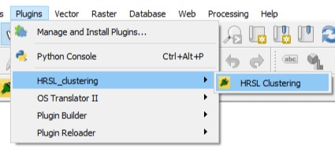

# Clustering-process

This repository contains the by KTH developed QGIS plugin used in order to generate population clusters. Running the plugin will result in a polygon vector file. Each polygon will represent a population cluster. The information contained in these polygons are: 

1. The population in each settlement (**Population**)
2. A unique identifier for each polygon. This is useful if the polygons are transformed at a later stage and then need to be merged again (**id**).
3. The maximum value of nighttime light detected in each cluster (**Nightlights**).
4. The number of people living in areas with detected nighttime light (**ElecPop**).
5. The area of each cluster (**Area**)
6. The name of the country/study area (**Country**)

### Content

This repository contains instruction on how to install and use the clustering plugin developed by KTH as well as three different plugins used for different types of data and versions of QGIS.

### How-to-use Instructions 

#### Available versions of the plugin
As of July 2019 there are three different plugins avialble:

  1. One using the population data obtained from the Global Human Settlement Layer (available [here](https://ghsl.jrc.ec.europa.eu/)). Note that this version of the plugin is only avialble for QGIS version 3.2
  2. One plugin developed for QGIS version 3.2 using the population data obtained from the High Resolution Settlement Layer (available [here](https://data.humdata.org/organization/facebook?sort=metadata_modifieddesc&page=1&q=&ext_page_size=25#dataset-filter-start))
  3. One plugin developed for QGIS version 3.4 (the latest stable version) using the population data obtained from the High Resolution Settlement Layer.

**Note:** The KTH team has found that the High Resolution Settlement Layer (HRSL) is more detailed and elaborate than the Global Human Settlement Layer (GHSL). The HRSL is not avialble on a global scale. The users are recommended to first check the availability of HRSL for their area of interest and then move to GHSL if HRSL is not available. 

#### How to install

**Note:** Istallation instructions are also avialble as a downloadable document [here](Instructions/Installation%20of%20plugin.docx)

1.	Download the zipped folder onto your computer.
2.	Open QGIS Desktop make sure that you use version 3.0 or newer. 
3.	On top of the window you have a number of menus, click on the one that reads Plugins.

	

4.	Next, go to Manage and Install Plugins…

	

5.	This will open a new window with a number of different options on the left-hand side. We will choose Install from ZIP
 	
	

6.	In the window that opens click on the three dots next to the empty field to navigate to wherever you saved the zipped plugin folder.
	
	

7.	When you have found it click Install plugin
 	
	

8.	After the plugin has been installed will appear under the Plugins menu on top of the screen. You are now ready to run the plugin.
	
	

8.	When the plugin is installed it appear under the Plugin menu with the name HRSL Clustering.
	
	
	
#### Additional resources needed in order to run the plugins
In order to run the clustering plugins three datasets are needed. 

**1**.  A population dataset. The population dataset has to be in the form of a raster. This raster will set the base of 	the clusters. It is recommended that you use the High Resolution Settlement Layer (available [here](https://data.humdata.org/organization/facebook)). If you area of interest is not available in High Resolution Settlement Layer database use the Global Human Settlement Layer instead (available [here](https://ghsl.jrc.ec.europa.eu/))

**2.**  Administrative boundaries. To run the plugin administrative boundaries are needed. These administrative boundaries will be used to clip your other datasets to the area of interest. They will also be used in order to limit the maximum area of the clusters and therefore it is highly recommended that you choose administrative boundaries that are disaggregated beyond the national borders. Administrative boundaries can be found e.g. [here](https://gadm.org/).

**3.** Nighttime lights. The nighttime lights map show anthropogenic light sources and will be used in order to determine the population living in areas with light emitting infrastructures present. The nighttime lights used are avialble [here](https://eogdata.mines.edu/download_dnb_composites.html). It is recommended that you use the cleaned data with outliers removed. These data are only avialble on a yearly basis and as of July 2019 the latest version is from 2016.
 
#### How to run the plugins

Detailed instructions for how to run the plugin is available [here](Instructions/How%20to%20run%20the%20clustering%20plugin.docx)

### Cautions

### Supplementary material

