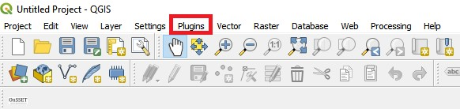
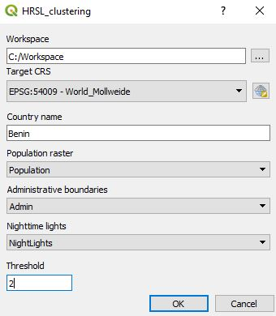

# PopCluster

PopCluster is a QGIS plugin that uses raster population, night-time light and administrative boundaries layers to generate vector based (polygon) population settlements or else "population clusters". 

## Plugin options
As of September 2019, there are three available versions of the plugin:

 * **Option 1.** Plugin developed for QGIS 3.4 (the latest stable version) and works with HRSL
 * **Option 2.** Plugin developed for QGIS 3.2 and works with HRSL 
 * **Option 3.** Plugin developed for QGIS 3.2 and works with GHS

**Note!** We recommend using a HRSL based version. The GHS based version shall be used only if HRSL is not available for your area of interest.

## Installation 

### Requirements

- QGIS [3.2](http://download.osgeo.org/qgis/) or [3.4](https://qgis.org/en/site/forusers/download.html)
- Python >= 3.6 with the following packages installed:
	- PyQt5
	- shutil
	- qgis
	- datetime

### Adding plugin on QGIS

1.	Download the zipped plugin folder onto your computer.
2.	Open QGIS Desktop (proper version)
3.	Click on the "Plugins" menu

	

4.	Go to "Manage and Install Plugins..."

	

5.	Choose Install from ZIP
 	
	

6.	In the window that opens click on the three dots next to the empty field to navigate to where you saved the zipped plugin folder
	
	

7.	Select it and click "Install plugin"
 	
	

8.	An installation progress bar will appear on top of the screen
	
	

9.	After the plugin is installed it appear under the "Plugins" menu with the name HRSL Clustering. It is now ready to use!
	
	
	
## Using the plugin

1.	Open the plugin in QGIS

2.	Add necessary input layers

* The population raster file ([HRSL](https://data.humdata.org/organization/facebook?sort=metadata_modifieddesc&page=1&q=&ext_page_size=25#dataset-filter-start) or [GHS](https://ghsl.jrc.ec.europa.eu/))
* The admin boundaries layer for the area of interest (e.g. [GADM](https://gadm.org/))
* The nighttime lights raster layer ([VIIRS](https://eogdata.mines.edu/download_dnb_composites.html))

3.	Run the plugin

If succesful, the resulting layer will be added in your workspace. The resulting clusters are attributed the following information:

1. **id** - a unique identifier for each cluster
2. **Country** - the name of the country/study area 
3. **Population** - population in defined year (based on HRSL published date)
4. **Area** - the area of each cluster (in sq.km)
5. **Nightlights** - the maximum value of nighttime light detected in each cluster
6. **ElecPop** - the number of people living in areas with detected nighttime light

Sample input/output files are available for Equatorial Guinea [here](Equatorial%20Guinea%20example%20case).

## Cautions

* The admin boundaries layer is used to delineate the area of interest and to limit the maximum area of the clusters;therefore it is highly recommended that you choose administrative boundaries that are disaggregated beyond the national borders.

* The nighttime lights map show anthropogenic light sources and will be used in order to determine the population living in areas with light emitting infrastructures present. It is recommended that you use the cleaned data with outliers removed. These data are only available on a yearly basis and as of July 2019 the latest version is from 2016.

* As of July 2019 the nighttime light map is mandatory to run the plugin. This will be updated in future versions of the plugin in which the use of nighttime lights will be optional.

## Supplementary material

* The methodology behind the plugin is published and publicly available [here](https://www.mdpi.com/1996-1073/12/7/1395)

* For any bugs reported please raise an issue on this repository

* For any additional information please contact the [KTH team](http://www.onsset.org/contact--forum.html)
